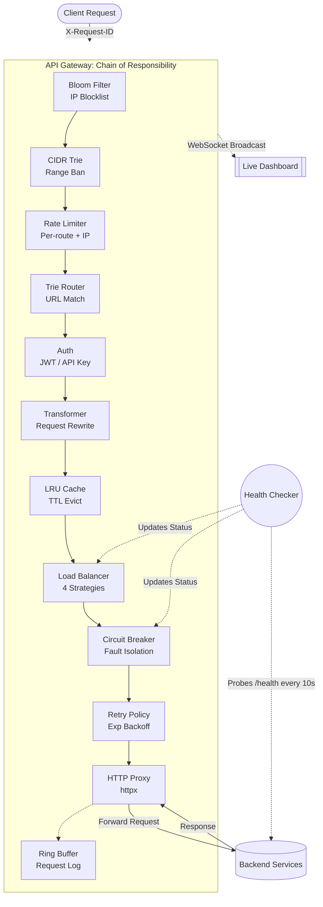
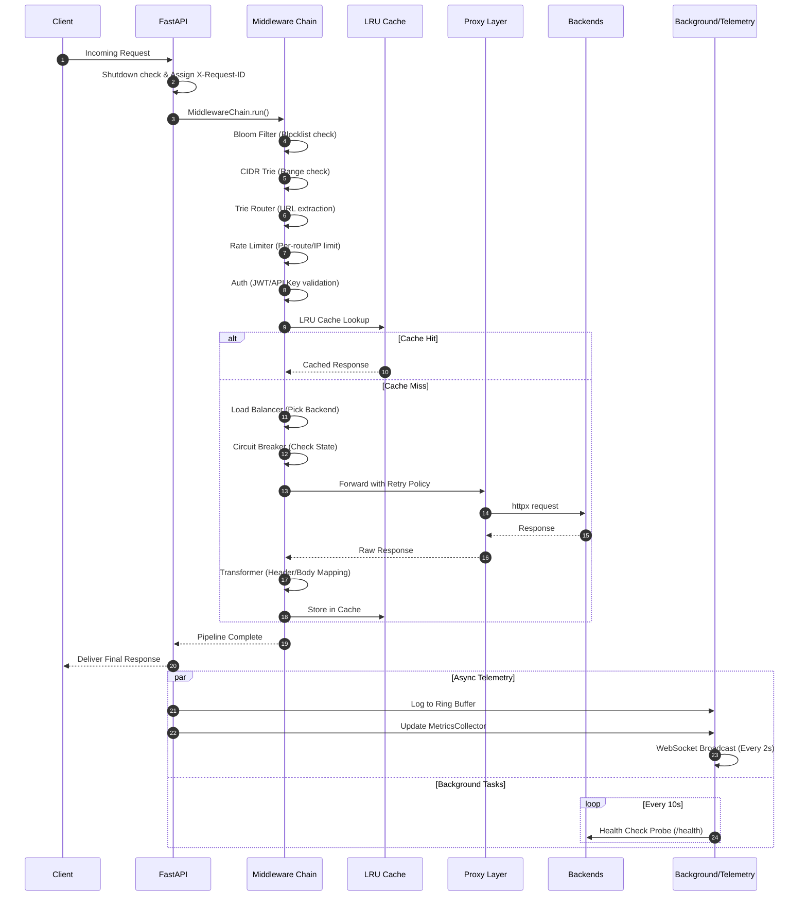

# Distributed Rate-Limited API Gateway

A fully functional API gateway with **13 custom-built data structures and algorithms** - implementing rate limiting, IP filtering, caching, routing, load balancing, circuit breaking, retry, health checking, and auth from scratch using Python and FastAPI.

**What** - An API gateway that sits between clients and backend services, applying a configurable middleware pipeline:
IP blocking -> rate limiting -> JWT/API key auth -> trie routing -> request transformation -> LRU caching -> consistent-hash load balancing -> circuit breaking -> retry with backoff -> HTTP proxying. Supports graceful shutdown with connection draining.

**Why** - To demonstrate system design patterns (token bucket, consistent hashing, bloom filters, circuit breakers, exponential backoff) commonly asked in SDE-2 interviews, all implemented from scratch without external algorithm libraries.

**How** - Every request passes through a Chain of Responsibility middleware pipeline. Each step uses a custom data structure (Trie, Bloom Filter, Token Bucket, LRU Cache, Consistent Hash Ring, etc.) with thread-safe locking.
Requests are proxied to real backends via httpx with retry logic. A live WebSocket dashboard visualizes all components in real time.

---

## Tech Stack

| Layer | Technology |
|---|---|
| **Backend** | Python 3.11, FastAPI (async) |
| **HTTP Proxy** | httpx (async client) with retry + backoff |
| **Auth** | PyJWT (HMAC-SHA256), API keys, hierarchical RBAC |
| **Hashing** | MurmurHash3 (`mmh3`) for Bloom filter, MD5 for consistent hash ring |
| **Rate Limiting** | In-memory (3 algorithms) + optional Redis-backed distributed |
| **Frontend** | Vanilla JS, Chart.js, WebSocket |
| **Infra** | Docker Compose, Redis (optional) |

---

## Architecture

## Architecture


---

## Project Structure

```text
api-gateway/
├── start.py                  # Quick start: python start.py
├── requirements.txt
├── render.yaml               # Render deployment config
├── docker/
│   ├── Dockerfile
│   └── docker-compose.yml
├── dashboard/
│   ├── index.html            # Dashboard structure
│   ├── styles.css            # Dashboard styling (teal theme)
│   └── app.js                # Dashboard JS + 7 visualizations
└── gateway/
    ├── main.py               # FastAPI app, admin API, WebSocket, graceful shutdown
    ├── config.py             # Route definitions, backend setup
    ├── middleware/
    │   ├── chain.py          # Chain of Responsibility pipeline
    │   └── transformer.py    # Request/response header & body transforms
    ├── proxy/
    │   ├── http_proxy.py     # httpx-based reverse proxy
    │   └── retry.py          # Exponential backoff retry policy
    ├── router/trie_router.py # Trie with param/wildcard support
    ├── ratelimit/
    │   ├── token_bucket.py         # Token bucket (burst control)
    │   ├── sliding_window_log.py   # Exact sliding window
    │   ├── sliding_window_counter.py # Approximate sliding window
    │   ├── rate_limiter.py         # Strategy composite (per-route + per-IP)
    │   └── redis_rate_limiter.py   # Redis-backed distributed sliding window
    ├── cache/lru_cache.py    # OrderedDict LRU + per-entry TTL
    ├── filter/
    │   ├── bloom_filter.py   # MurmurHash3 probabilistic filter
    │   └── cidr_trie.py      # Binary trie for IP range matching
    ├── auth/
    │   ├── jwt_auth.py       # JWT generation + RBAC validation
    │   └── api_key_auth.py   # API key generation + validation
    ├── balancer/
    │   ├── load_balancer.py  # RR / Weighted / Least Conn / Consistent Hash
    │   └── health_checker.py # Active backend probing with thresholds
    ├── circuitbreaker/circuit_breaker.py # Per-backend state machine
    ├── metrics/collector.py  # Latency percentiles, counters
    └── log/ring_buffer.py    # Fixed-size circular request log
```

---

## Code Flow


```text
 1. Request arrives       -> FastAPI catch-all route
 2. Shutdown check        -> draining? -> 503 (Connection: close)
 3. In-flight tracking    -> increment counter for graceful drain
 4. X-Request-ID assign   -> use incoming header or generate UUID4
 5. MiddlewareChain.run() -> Chain of Responsibility pipeline
 6. Bloom Filter check    -> blocked IP? -> 403
 7. CIDR Trie check       -> IP in blocked range? -> 403
 8. Trie Router lookup    -> match path + extract params -> 404
 9. Rate Limiter check    -> per-route per-IP bucket -> 429
10. Auth check            -> API key (X-API-Key) or JWT Bearer -> 401/403
11. LRU Cache check       -> cache hit? -> return cached response
12. Load Balancer select  -> pick backend (RR / weighted / least conn / consistent hash)
13. Circuit Breaker check -> backend circuit open? -> 503
14. Retry + Proxy         -> httpx forward with exponential backoff (max 3 retries)
15. Response transform    -> apply header injection/removal, body field mapping
16. Cache response        -> store in LRU with TTL
17. Ring Buffer log       -> record request metadata
18. MetricsCollector      -> update counters, latencies
19. WebSocket broadcast   -> push metrics to dashboard (every 2s)
20. Health Checker (bg)   -> probe /health on all backends every 10s
```

---

## Quick Local Setup

**Prerequisites**: Python 3.11+, Docker (optional), Redis (optional - for distributed rate limiting)

```bash
# 1. Setup
python -m venv venv
source venv/bin/activate       # macOS/Linux
venv\Scriptsctivate          # Windows
pip install -r requirements.txt

# 2. Run (mock backends - default)
python start.py

# 2b. Run with real API backends (JSONPlaceholder + DummyJSON)
USE_MOCK_BACKENDS=false python start.py

# 2c. Enable Redis-backed distributed rate limiting
RATE_LIMIT_REDIS_ENABLED=true REDIS_URL=redis://localhost:6379 python start.py

# 3. Open dashboard
open http://localhost:8000/dashboard
```

| Service | URL |
|---|---|
| Dashboard | `http://localhost:8000/dashboard` |
| Swagger Docs | `http://localhost:8000/docs` |
| Metrics API | `http://localhost:8000/admin/stats` |
| Health Checker | `http://localhost:8000/admin/health-checker` |
| WebSocket | `ws://localhost:8000/ws/metrics` |

---

## Deploy to Render (Free)

1. Push your repo to GitHub
2. Go to [Render](https://render.com) -> **New** -> **Web Service** -> Connect your repo
3. Render auto-detects `render.yaml` -> builds via `docker/Dockerfile`
4. Environment variables are pre-configured in `render.yaml`:

| Variable | Value |
|---|---|
| `USE_MOCK_BACKENDS` | `false` |
| `ENABLE_TRAFFIC_SIM` | `true` |

5. Deploy -> Dashboard available at `https://<your-app>.onrender.com/dashboard`

> **Note**: Free Render instances sleep after 15 min of inactivity. First request after idle takes ~30s to cold-start.

### Real API Backends

When `USE_MOCK_BACKENDS=false`, the gateway proxies to real public APIs:

| Backend | Weight | Example Routes |
|---|---|---|
| `https://jsonplaceholder.typicode.com` | 3 | `/posts`, `/users`, `/todos`, `/comments` |
| `https://dummyjson.com` | 2 | `/products`, `/users`, `/posts`, `/todos` |

All gateway features (rate limiting, caching, circuit breaking, auth, load balancing) work against these real backends.

---

## Features

- **Trie-based URL routing** - prefix tree with `:param` and `*wildcard` support, O(k) lookup
- **3 rate limiting algorithms** - Token Bucket, Sliding Window Log, Sliding Window Counter; runtime switchable
- **Per-route rate limiting** - each route gets its own rate limit bucket per client IP
- **Distributed rate limiting** - optional Redis-backed sliding window for multi-instance deployments
- **LRU response cache** - OrderedDict-based with per-entry TTL and eviction tracking
- **Bloom filter IP blocking** - probabilistic check with configurable false-positive rate (MurmurHash3)
- **CIDR binary trie** - deterministic IP range blocking with bit-level prefix matching
- **Load balancing** - Round Robin, Weighted Round Robin, Least Connections, Consistent Hashing; runtime switchable
- **Consistent hash ring** - MD5-based with 150 virtual nodes per backend, O(log n) lookup
- **Circuit breaker** - per-backend state machine (CLOSED/OPEN/HALF OPEN) for fault isolation
- **Retry with exponential backoff** - configurable max retries, base delay, jitter to prevent thundering herd
- **HTTP reverse proxy** - httpx-based async forwarding to real backends with header propagation
- **Request/response transformation** - header injection/removal, path rewriting, body field mapping
- **JWT auth + RBAC** - HMAC-SHA256 tokens with hierarchical role checking (admin > user > viewer)
- **API key authentication** - generate, validate, and revoke static API keys as an alternative to JWT
- **Request ID / correlation ID** - UUID4 per request, honors incoming X-Request-ID for distributed tracing
- **Active health checking** - background task probes backend `/health` endpoints, auto-marks healthy/unhealthy
- **Graceful shutdown** - SIGTERM handler stops accepting new requests, drains in-flight connections (30s timeout)
- **Ring buffer logging** - fixed-size circular buffer for bounded-memory request logging
- **Live WebSocket dashboard** - real-time stat cards, latency bars, doughnut charts, per-component panels
- **Admin API** - runtime config for all components (block IPs, switch strategies, clear cache, generate tokens/keys)

---

## Dashboard Guide

Open the dashboard at `http://localhost:8000/dashboard` after starting the server. All panels update in real time via WebSocket (every 2 seconds).

### Top Bar

| Element | What it shows | How to test |
|---|---|---|
| **Simulator toggle** | (top-right) Green dot = running, slide button on/off | Click the toggle -> toast shows "Simulator enabled/disabled" |
| **Status mini text** | Shows request count (e.g. "4.2k reqs") or "off" | Observe it increment while simulator is on |
| **Time** | Current time, updates every 2s with each WebSocket message | Automatic |

### Stat Cards (always visible)

| Card | Meaning | Data source |
|---|---|---|
| **Requests** | Total requests processed (simulated + real) | `metrics.total_requests` |
| **RPS** | Requests per second (60s sliding window) | `metrics.rps` |
| **P50 Latency** | Median latency in ms | `metrics.p50` |
| **P99 Latency** | 99th percentile latency (tail) | `metrics.p99` |
| **Error Rate** | % of requests with status >= 400 | `metrics.error_rate` |
| **Cache Hit Rate** | % of cache hits vs total lookups | `cache.hit_rate` |

### Sidebar Tabs

#### 1. Overview (default)

- **Latency Distribution** - P50/P95/P99 horizontal bars. Green = fast, red = slow
- **Status Codes** - Doughnut chart: 2xx (green), 4xx (yellow), 5xx (red)
- **Traffic Heatmap** - Grid showing requests per route per minute. Darker teal = more traffic. 15-minute window
- **Load Balancer** - Shows each backend with health dot, weight, active connections, request count
  - **Test it**: Change the strategy dropdown (Round Robin / Weighted / Least Connections / Consistent Hash) -> toast confirms

#### 2. Topology

- **Network Topology SVG** - Animated visualization showing: Client -> IP Filter -> Rate Limit -> Auth -> Transform -> Cache -> Proxy -> Backends
- Animated dots ("packets") flow through the pipeline
- Backend circles show green (healthy) or red (unhealthy)

#### 3. Request Log

- **Terminal-style log viewer** - Shows real-time request entries:
```text
12:30:45 GET 200 /api/v1/products 33.42ms proxy http://localhost:9001
```
- Color-coded: green = 2xx, yellow = 4xx, red = 5xx
- **Test it**:
  - Type in the grep filter box (e.g. `POST` or `401`) to filter entries
  - Click **Auto/Manual** button to toggle auto-scroll
  - Click **Clear** to reset the ring buffer
  - Stats bar shows: entries/capacity | total logged | fill %

#### 4. Rate Limiter

- **Strategy dropdown** - Switch between:
  - **Token Bucket** - O(1), allows bursts, shows tokens remaining per client
  - **Sliding Window Log** - O(log n), exact counting, shows request count per window
  - **Sliding Window Counter** - O(1), approximate, interpolated count
- **Test it**: Change the dropdown -> algorithm description updates, client bucket bars change
- **Client buckets** - Each simulated IP shows a fill bar (green/yellow/red based on remaining capacity)

#### 5. Cache (LRU)

- **Cache Stats** - Entries, capacity, hits, misses, hit rate %, evictions
- **Hit/Miss Ratio** - Doughnut chart (green = hits, red = misses)
- **Test it**: Click **Clear Cache** -> cache resets to 0, hit rate drops temporarily as simulator repopulates

#### 6. IP Blocklist (Bloom Filter + CIDR Trie)

Two panels side by side:

**Bloom Filter (exact IPs):**
- Shows: blocked IP count, bit array size, hash functions, fill ratio, false positive rate
- Visual: Grid of bits (green = set, dark = unset)
- **Test it**:
  - Type `1.2.3.4` -> click **Block** -> toast confirms
  - In IP Checker, type `1.2.3.4` -> click **Check Bloom** -> toast says "BLOCKED"
  - Type `5.5.5.5` -> click **Check Bloom** -> toast says "ALLOWED"

**CIDR Trie (prefix ranges):**
- Shows: CIDR rule count, trie nodes, max depth, listed CIDR ranges with x to remove
- Pre-seeded with `203.0.113.0/24` and `198.51.100.0/24`
- **Test it**:
  - Type `10.0.0.0/8` -> click **Block** -> new CIDR tag appears
  - In IP Checker, type `10.0.1.10` -> click **Check CIDR** -> toast says "BLOCKED by CIDR 10.0.0.0/8"
  - Click the x on a CIDR tag to remove it

#### 7. Circuit Breaker

- **State Machine SVG** - 3 nodes: CLOSED (green), OPEN (red), HALF_OPEN (yellow)
- Arrows show transitions: "threshold hit", "timeout expires", "probe success", "probe fails"
- Active state glows. Click **CLOSED** to reset all breakers
- **Breaker Cards** - One per backend showing:
  - State badge (closed/open/half_open)
  - Failure count vs threshold, total requests, blocked count
  - Progress bar showing failure window fill
  - If OPEN: countdown timer to auto-reset

#### 8. Health

Three panels:

- **Health Checker** - Shows probe interval, timeout, thresholds, per-backend status (healthy/unhealthy), latency, check count, failure count
- **Retry Policy** - Shows max retries, base delay, jitter, total calls, retry rate, exhausted rate
- **Request/Response Transformer** - Shows transformation rules (e.g. add HSTS header, remove Server header) and how many times each rule has been applied. This tracks header injection/removal on every response passing through the gateway

#### 9. Routes & Trie

- **Routes Table** - All registered routes with method, path, backend, auth requirement, role, rate limit, cache TTL
- **Trie Visualization** - Tree structure showing how URLs are stored in the trie. Click -/+ to collapse/expand nodes. Color-coded:
  - White = static segments (`api`, `v1`)
  - Purple = parameter segments (`:id`)
  - Yellow = wildcard (`*`)

#### 10. Tools (Auth & Testing)

**Authentication:**
- **JWT Token** - Enter client ID + role -> click **Generate** -> token appears and auto-fills the test request field
- **API Key** - Enter client ID + role -> click **Generate** -> API key generated

**Send Test Request:**
- Select method (GET/POST/PUT/DELETE), enter path (e.g. `/api/v1/products`)
- Optionally paste a Bearer token or API key
- Click **Send** -> shows:
  - Response status, headers (`X-Request-ID`, `X-Cache`, `X-Backend`, `X-Circuit-Breaker`)
  - Response body JSON
  - **Waterfall timeline** - horizontal bar chart showing time spent in each middleware step (IP Filter, Rate Limit, Auth, Transform, Cache, Proxy)

**Test scenarios:**

| Test | Expected Result |
|---|---|
| `GET /api/v1/products` (no auth) | 200 - public route |
| `GET /api/v1/users` (no auth) | 401 - requires authentication |
| `GET /api/v1/users` (JWT with `admin` role) | 200 - authorized |
| `GET /api/v1/orders` (JWT with `viewer` role) | 403 - insufficient role |
| Send same GET twice | Second request shows `X-Cache: HIT` |
| Block your IP in Bloom Filter, then send request | 403 - IP blocked |

---

## Algorithms, OS Concepts & Engineering Patterns

### Algorithms & Data Structures
- **Trie (Prefix Tree)** - URL routing with parameter extraction and wildcard matching, O(k) per lookup
- **Token Bucket** - burst-tolerant rate limiting with steady refill, O(1) per check
- **Sliding Window Log** - exact per-client request tracking with sorted timestamps, O(log n) per check
- **Sliding Window Counter** - approximate rate limiting blending current + previous window, O(1) per check
- **LRU Cache** - `OrderedDict` with O(1) get/put and per-entry TTL expiration
- **Bloom Filter** - space-efficient probabilistic set with MurmurHash3, O(k) per check
- **Binary Trie** - bit-level prefix tree for CIDR range matching on 32-bit IPs, O(W) per check
- **Consistent Hash Ring** - MD5-hashed virtual nodes with binary search for O(log n) lookup, minimal key remapping on node change
- **Ring Buffer** - fixed-size circular array with head pointer, O(1) insert
- **Bisect percentile** - sorted latency array with binary search for P50/P95/P99
- **Exponential Backoff** - `base_delay * 2^attempt + jitter`, capped at max_delay; prevents thundering herd
- **Redis Sorted Set** - distributed sliding window using ZRANGEBYSCORE for O(log n) rate limiting

### OS / Concurrency Concepts
- **Thread safety** - all data structures use `threading.Lock` for concurrent access
- **Async I/O** - FastAPI async handlers with `asyncio` for non-blocking request processing
- **Bounded buffers** - ring buffer and LRU cache enforce fixed memory usage
- **TTL expiration** - lazy eviction on access (cache) and periodic cleanup
- **Signal handling** - SIGTERM/SIGINT handlers for graceful shutdown
- **Connection draining** - in-flight request counter with async event for clean shutdown
- **Correlation IDs** - UUID4 propagated across request/response for distributed tracing

### Software Engineering Patterns
- **Chain of Responsibility** - middleware pipeline; each step can short-circuit or pass through
- **Strategy** - rate limiter and load balancer support runtime algorithm switching
- **Circuit Breaker** - CLOSED -> OPEN -> HALF_OPEN state machine to isolate failing backends
- **Retry with Backoff** - exponential backoff with jitter wrapping the proxy layer
- **Reverse Proxy** - transparent HTTP forwarding via httpx with header propagation
- **Request/Response Transformation** - configurable rules for header injection, path rewriting, body mapping
- **Health Check Probes** - active background polling with consecutive-failure thresholds
- **Factory** - route/backend registration via config functions
- **Observer** - WebSocket broadcasts metrics to all connected dashboard clients
- **Separation of Concerns** - each algorithm is a standalone module with its own file
